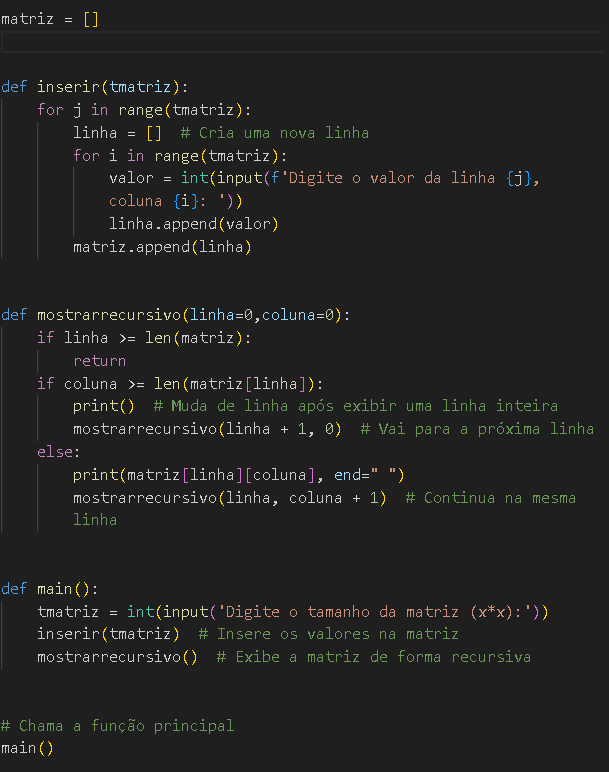
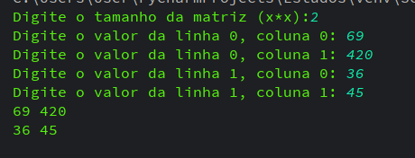

# Relatório final do projeto
#### Autor: Héberton Santiago 18/08/2024

#

#
### Começemos por partes:
Para começar a programação primeiro deve-se criar uma matriz vazia para prosseguir

Em seguida começamos pela função de inserimento, o usuário fornece um valor na classe **main()**, em seguida este valor é levado até a classe **inserir(tmatriz)**(tmatriz = tamanho matriz)

Após o usuário ter fornecido o tamanho da matriz por completo, (ou seja após ele inserir o tamanho é assimilado uma matriz de x*x) o programa segue para a função de inserir valores na matriz, onde o usuário insere os valores desejados.

### Mostrar Recursivamente
Agora que a matriz está preenchida, o programa segue para a função de **mostrarrecursivo()**,para isso seguiremos por partes o que cada *if* realiza:
- **if linha >= len(matriz)**: Nesse caso, o programa irá conferir se todos os itens da linha foram exibidos.
- **if coluna >= len(matriz[linha])**: Aqui o programa faz uma verificação para saber se a coluna é menor ou igual ao tamanho da linha, e caso for ira pular para a próxima e continuar exibindo
- **else: print(matriz[linha][coluna])**: Aqui o programa ira exibir item por item
- **mostrarrecursivo(linha + 1, coluna)**: E aqui é o somatório aonde vai adicionando valores afim de percorrer toda coluna em cada uma das linhas
## E após finalizar todo o processo, o programa se encerra deixando o usuário com o resultado do que construiu:
### Este é um exemplo de uma matriz 2x2